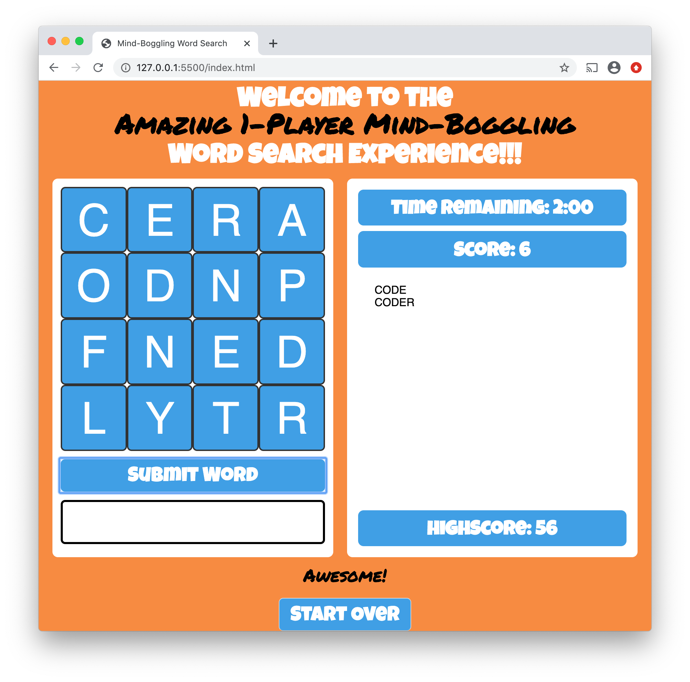
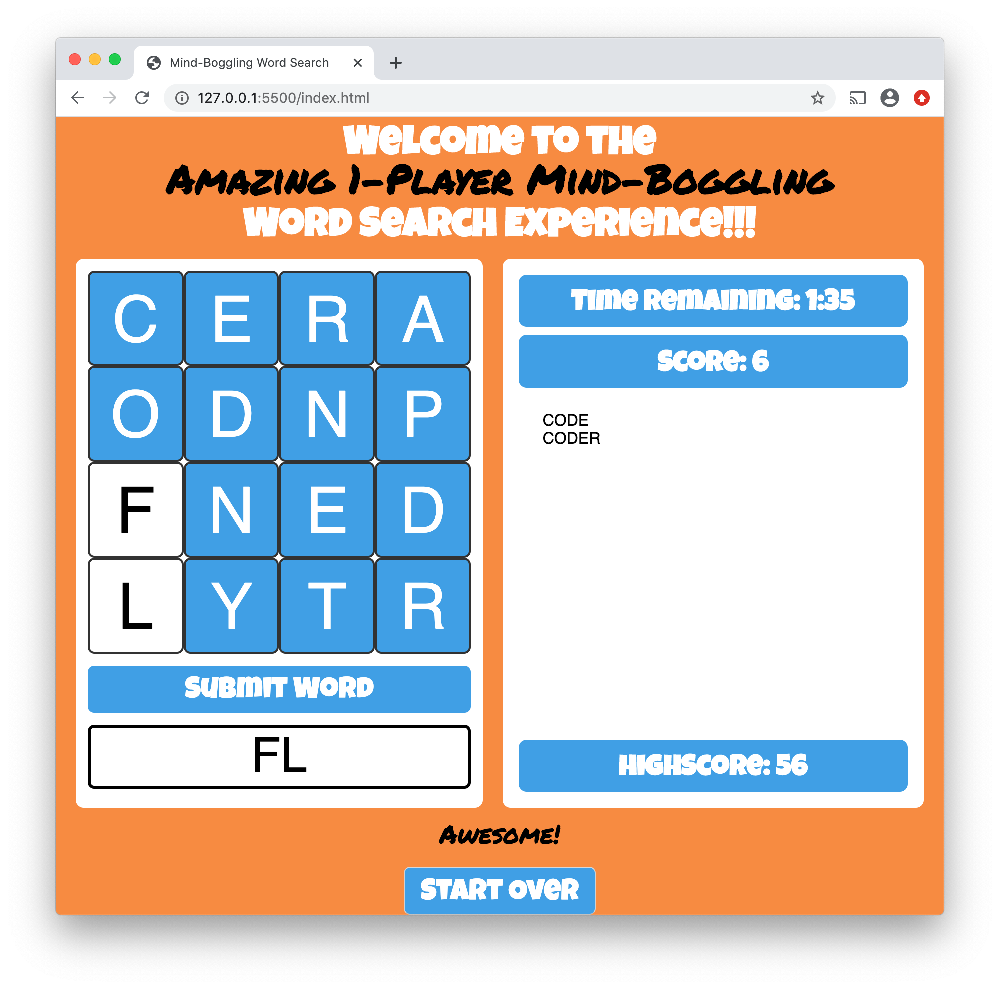
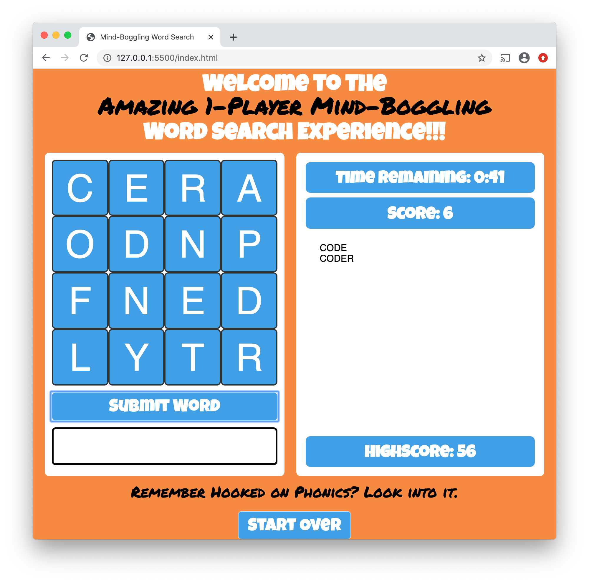
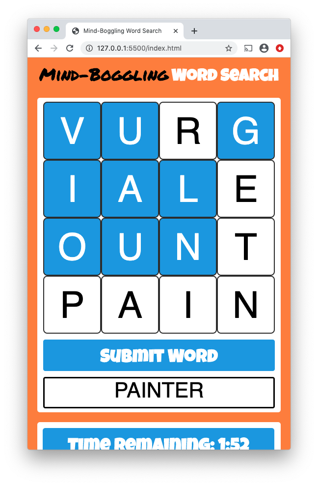

# Solo Boggle
A browser-based 1-player version of Boggle, produced after two weeks of learning code.

## What is this Game?
In this game you'll compete against the clock (and the powers of an RNG-based board) to see how many words you can find on a 4 by 4 grid of letters. Typically, Boggle is played as a competitive game against 1 or more opponents. Here, the only thing that can beat you, is you yourself. Oh! And RNG! RNG can pretty much destroy you. There is a 1 in 9816 chance that you get a board that's entirely made of 'Qu' tiles. 

So you and RNG. Those are the only things that can beat you.

## How Do I Play?
Once you start the game, you will have 3 minutes to search for words. To locate a word, click on the first letter; then the next letter of the word can be any of the neighboring tiles (left, right, up, down, or diagonal). Once you use a letter it cannot be used again in building that word. Every word you find yields points as follows:

- 1 or 2 letters – 0 points
- 3 or 4 letters – 1 point
- 5 letters – 2 points
- 6 letters – 3 points
- 7 letters – 5 points
- 8 or more letters – 11 points

Please note that the 'Qu' tile counts as two letters.

## Screenshot(s)

Here's where it all started: 

I know. The handwriting and drawing is terrible. There are a lot of reasons for me to stick to key-based inputs. Here's what it came to:

The current only input is the mouse click; this may be remedied in a future update (more plans below). Colors were inspired from the memory of a version of Boggle that I played quite often way back when I was dating my wife. The game we played didn't do this:

Isn't that fancy? I don't know if it helps much (or at all), but it sure is satisfying to see my words form on the board. Maybe that makes it hurt just a little bit more when you screw up:

The program randomly pulls from a collection of insults if you submit a notword. If clicking letters isn't really your thing, we do offer one more option:

Tapping. Load it up in your mobile browser for a finger-tappin' fun time!

## Technologies Used

This project was constructed using HTML, CSS, and JavaScript with jQuery. 

Dictionary comes courtesy of GitHub user dwyl: https://github.com/dwyl/english-words

This dictionary is available for use under the [Unlicense](https://unlicense.org).

Letter distribution comes via the weighted distribution of letters in Scrabble. It's a pretty darn good approximation of the frequency of use of letters in the English language.

## Getting Started

First, read the instructions from the 'How Do I Play?' section above. Then click [here](https://sgluchacki.github.io/solo-boggle/) to navigate to the game. Have fun!

## Challenges

CSS. It's always CSS. Why is it that whenever I try to adjust one trivial setting the entire page looks like a warzone? It's okay. I rebuild, and rebuild, and learn some new things.

On a more serious note, it was trickier than expected to correctly enable and disable clicks where appropriate on the board. This resulted in a rather inglorious code block that was later compressed into a (much more glorious) single line (main.js line 120). This code also turned out to be rather important with regards to properly coloring the letter tiles.

## Next Steps

Multiplayer would be great; I'd love to create a browser-based competitive version of this. I plan to get around to this; I've just got a bit more to learn first. High scores, player rankings (and logins), and more may be available in the long term. I envision deploying a version where a group of people can each play a board at their leisure and will later be ranked against one-another (and receive a notification of rankings). I'd love to even incorporate a tournament version if there ever is enough interest.

At some point, I'll also go through and organize the accolades and insults and make them have far more specific triggers – think 'you're on fire' after three words in a row a la NBA Jam. 

Additionally, there are still a couple more hurdles to cross with the mobile version: the messages need to move up to a more visible location and there's some mysterious thing happening with the header that causes it to extend past the width of the body, regardless of most adjustments. The only thing that has shown signs of success with the header is setting the width property to fit-content. Only problem here is that all margins on the body go loopy. 25,000 super-secret internet points to anybody that finds a logical solution.

Oh, and one more thing. There's a lingering rumor that original music may be coming soon.

